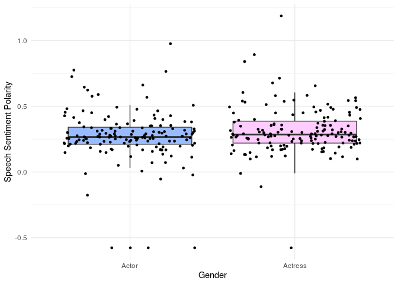
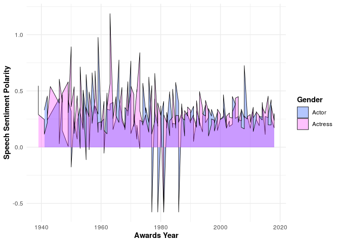
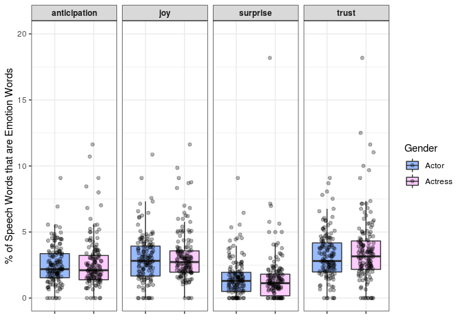
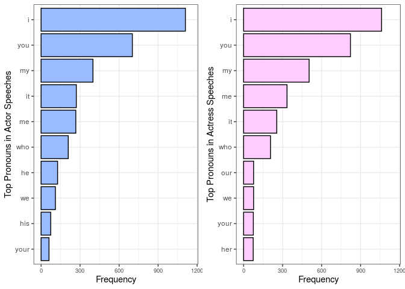
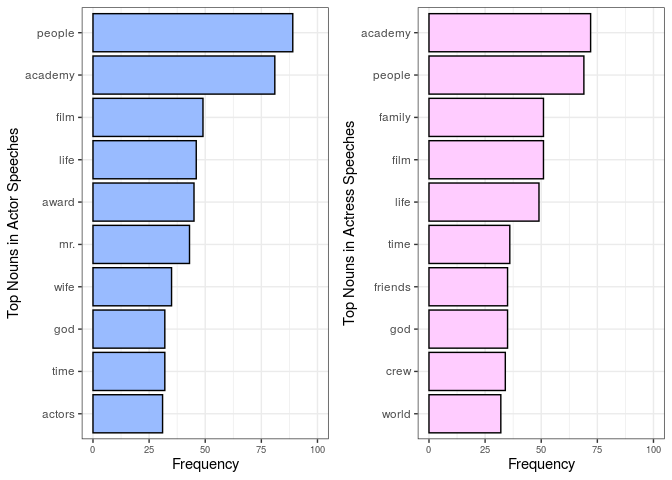
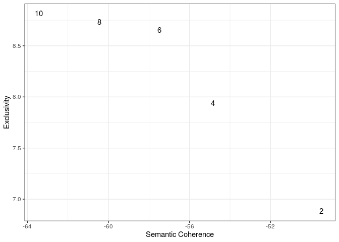
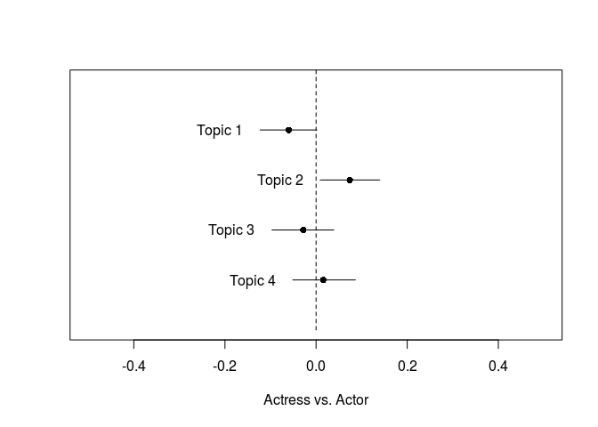
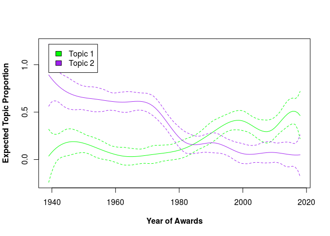
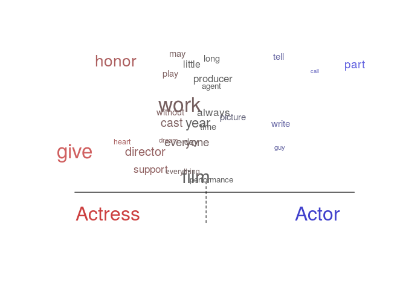
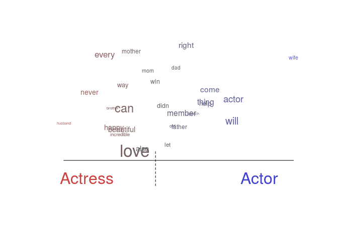

Analysis
================

## Sentiment Analysis

Using sentence-level sentiment analysis, compare the emotional valence
of speeches given by actors and those given by actresses using average
sentiment polarity scores.

``` r
# install & load necessary packages
install.packages("pacman")
pacman::p_load(ggplot2, 
               tm, 
               textreg,
               textstem, 
               plyr, 
               tidyr,
               dplyr, 
               syuzhet, 
               lexicon, 
               sentimentr, 
               install=TRUE)
```

Preprocessing steps: convert all letters to lower case, remove numbers,
and remove white space.

``` r
# read corpus
speeches = readRDS("speeches_clean.rds")

# preprocess corpus for sentiment analysis
# note: don't remove punctuation - needed to detect sentences
speeches.corpus.tm = VCorpus(VectorSource(speeches$Speech))
speeches.corpus.tm = tm_map(speeches.corpus.tm, content_transformer(tolower))
speeches.corpus.tm = tm_map(speeches.corpus.tm, removeNumbers)
speeches.corpus.tm = tm_map(speeches.corpus.tm, stripWhitespace)

# check
inspect(speeches.corpus.tm[[1]])
```

    ## <<PlainTextDocument>>
    ## Metadata:  7
    ## Content:  chars: 509
    ## 
    ##  ladies and gentlemen, please forgive me if my words are inadequate in thanking you for your very great kindness. if i were to mention all those who have shown me such wonderful generosity through "gone with the wind" i should have to entertain you with an oration as long as "gone with the wind" itself. so if i may, i should like to devote my thanks on this occasion to that composite figure of energy, courage, and very great kindness, in whom all points of "gone with the wind" meet -- mr. david selznick.

``` r
# convert corpus to character vector to use with sentimentr
speeches.corpus.tm = convert.tm.to.character(speeches.corpus.tm)
```

Using the package sentimentr, calculate sentiment polarity scores per
sentence per speech.

``` r
# sentence-level sentiment
sentences = sentimentr::get_sentences(speeches.corpus.tm) 
sent.sentiment = sentiment(sentences)
head(sent.sentiment)
```

    ##    element_id sentence_id word_count sentiment
    ## 1:          1           1         19 0.8144259
    ## 2:          1           2         36 0.2250000
    ## 3:          1           3         38 0.5921082
    ## 4:          2           1         18 0.4242641
    ## 5:          2           2         34 0.2572479
    ## 6:          2           3         28 0.2041008

``` r
# sentiment-coded speech transcripts
sentiment.bySpeech = sentiment_by(sentences, by = NULL) 
# highlight(sentiment.bySpeech)
# intuitively, it makes sense that most sentences are positive-sentiment since these are award acceptance speeches
```

Compare emotional valence across gender by comparing the average
polarity scores of actors and actresses’ speeches. Create a boxplot of
average polarity scores, where each dot represents one speech given by
either an actor or an actress.

``` r
# average speech sentiment by gender
gender = as.data.frame(speeches$Gender)
colnames(gender) = "gender"
gender$element_id = 1:nrow(gender)
sentiment.bySpeech = left_join(sentiment.bySpeech, gender, by = "element_id")

# visualize
ggplot(sentiment.bySpeech, 
       aes(x = as.factor(gender), 
           y = ave_sentiment,
           fill = as.factor(gender))) +
  geom_boxplot(aes(fill = as.factor(gender)), 
               outlier.shape = NA) +
  geom_jitter(size = 1) +
  labs(y = "Speech Sentiment Polarity", x = "Gender") +
  theme_minimal() +
  theme(legend.position = "none")+
  scale_fill_manual(values = c("#99bbff","#ffccff"))
```

<!-- -->

Some summary stats:

``` r
# summary stats
sentiment.bySpeech %>% group_by(gender) %>%
  summarise(mean(ave_sentiment), sd(ave_sentiment))
```

    ## # A tibble: 2 x 3
    ##   gender  `mean(ave_sentiment)` `sd(ave_sentiment)`
    ##   <fct>                   <dbl>               <dbl>
    ## 1 Actor                   0.269               0.210
    ## 2 Actress                 0.313               0.180

While the distribution of the polarity scores appear similar for actors
and actresses, the mean score is slightly higher for actresses’
speeches, and the spread is slightly lower for actresses’ speeches. This
implies that actresses’ speeches on average have a slightly more
positive sentiment than actors’ speeches, although the difference is
subtle.

Extra: visualize the average sentiment by gender over time.

``` r
# average sentiment by gender over time
date = as.data.frame(speeches$Year)
colnames(date) = "date"
date$element_id = 1:nrow(date)
sentiment.bySpeech = left_join(sentiment.bySpeech, date, by = c("element_id") )

# visualize
ggplot(sentiment.bySpeech, 
       aes(x = date, y = ave_sentiment, 
           group = as.factor(gender) ) ) +
  geom_density(aes(fill = as.factor(gender) ), stat = "identity", alpha = .3, size = 0.3) +
  ylab("Speech Sentiment Polarity") +
  xlab("Awards Year") +
  theme_minimal() +
  theme(axis.title = element_text(face = "bold"),
        legend.title = element_text(face = "bold")) +
  scale_fill_manual(name = "Gender",
                    breaks = c("Actor", "Actress"),
                    values = c("#0040ff","#ff33ff"))
```

<!-- -->

Emotion classification: explore what specific positive emotions are
expressed in these speeches with the package syuzhet. Create boxplots
comparing the relative prevalence of each aforementioned emotion in
actors and actresses’ speeches. Each dot in the boxplot represents a
speech, and the emotion words counts are normalized by their respective
total speech word counts.

``` r
# emotion
emotions = get_nrc_sentiment(speeches.corpus.tm)

# normalize emotion count by total word count
emotions = emotions/sentiment.bySpeech$word_count
emotions$Gender = gender$gender

# visualize emotion trends
emotions.long = emotions %>%
  pivot_longer(-Gender, names_to = "Emotions", values_to = "Value")

ggplot(emotions.long %>% filter(Emotions %in% c("anticipation", "surprise", "joy", "trust")), 
       aes(x = as.factor(Gender), 
           y = Value*100,
           fill = as.factor(Gender))) +
  geom_boxplot(aes(fill = as.factor(Gender)),
               outlier.shape = NA) +
  geom_jitter(width = 0.2, alpha = 0.3) +
  facet_grid(cols = vars(Emotions)) +
  labs(y = "% of Speech Words that are Emotion Words", x = "") +
  theme_bw() +
  theme(axis.text.x = element_blank(),
        legend.position = "right",
        strip.text.x = element_text(face = "bold")) +
  scale_y_continuous(limits = c(0,20)) +
  scale_fill_manual(name = "Gender",
                    values = c("#99bbff","#ffccff"))
```

<!-- -->

From the plots above, there are no significant differences in the amount
of positive emotion words used in actors and actresses’ speeches, even
when broken down by specific emotions. This suggests that while
actresses’ speeches have a slightly more positive sentiment, the
difference is hardly observable when studying specific emotions.

## Part-of-Speech Tagging

Investigate if there are any differences between actors and actresses in
terms of whom and what they talk about in their acceptance speeches
using the package tagger for part-of-speech tagging.

Note: Stop words removed when analyzing nouns, but stop words not
removed when analyzing pronouns. This is because pronouns are often
considered stop words.

``` r
# install & load necessary packages
pacman::p_load_gh(c(
  "trinker/termco", 
  "trinker/coreNLPsetup",        
  "trinker/tagger"
), install = T)

pacman::p_load(ggpubr,
               tidyverse, 
               tidytext, 
               cleanNLP, 
               RCurl, 
               textclean, 
               install=TRUE)
```

**Pronouns**  
Plot the top 10 most frequently occurring pronouns in each gender.

``` r
# most common pronouns
tidy.actor = tag_pos(speeches[speeches$Gender=="Actor",]$Speech) %>% as_basic() %>% tidy_pos()
tidy.actress = tag_pos(speeches[speeches$Gender=="Actress",]$Speech) %>% as_basic() %>% tidy_pos()

actor.pronouns = tidy.actor %>% 
  mutate(token = tolower(token)) %>%
  filter(pos=="pronoun") %>% 
  count(token, sort = TRUE) %>% 
  #anti_join(stop_words, by = c("token" = "word")) %>% 
  top_n(10, n) %>% 
  mutate(word = fct_inorder(token))

actress.pronouns = tidy.actress %>% 
  mutate(token = tolower(token)) %>%
  filter(pos=="pronoun") %>% 
  count(token, sort = TRUE) %>% 
  #anti_join(stop_words, by = c("token" = "word")) %>% 
  top_n(10, n) %>% 
  mutate(word = fct_inorder(token))

# Plot the most common pronouns
actor.plot = ggplot(actor.pronouns, aes(x = fct_rev(word), y = n)) +
  geom_bar(aes(x = fct_rev(word), y = n), stat = "identity", color = "black",
           fill = "#99bbff") +
  xlab("Top Pronouns in Actor Speeches") + ylab("Frequency") +
  ylim(0, 1150) +
  theme_bw() +
  coord_flip() + 
  theme(axis.text.x = element_text(size = 7))

actress.plot = ggplot(actress.pronouns, aes(x = fct_rev(word), y = n)) +
  geom_bar(aes(x = fct_rev(word), y = n), stat = "identity", color = "black",
           fill = "#ffccff") +
  xlab("Top Pronouns in Actress Speeches") + ylab("Frequency") +
  ylim(0, 1150) +
  theme_bw() +
  coord_flip() + 
  theme(axis.text.x = element_text(size = 7))

ggarrange(actor.plot, actress.plot, align = "v")
```

<!-- -->

Comparing the top six pronouns, there are no significant differences
across the pronouns in each gender, but there is a slight variation in
the bottom four pronouns. The pronouns *he* and *his* rank seventh and
ninth for actors respectively, but neither one of these pronouns appear
in the top 10 for actresses. On the other hand, *her* does not appear in
the actors’ top 10 pronouns, but it does in the actresses’ top 10. The
pronoun *our* ranks seventh for actresses, but it does not appear in the
actors’ top 10. While these differences are subtle, as the most
prominent pronouns are nearly identical across gender, they provide some
evidence of a slight variation in terms of who actors and actresses
speak about in their acceptance speeches. In particular, the comparison
of the occurrence of gendered pronouns could imply that actors tend to
mention more men in their speeches, whereas actresses tend to mention
more women.

**Nouns**  
Plot the top 10 most frequently occurring nouns in each gender.

``` r
# most common nouns
actor.nouns = tidy.actor %>% 
  mutate(token = tolower(token)) %>%
  filter(pos=="noun") %>% 
  count(token, sort = TRUE) %>% 
  anti_join(stop_words, by = c("token" = "word")) %>% 
  top_n(10, n) %>% 
  mutate(word = fct_inorder(token))

actress.nouns = tidy.actress %>% 
  mutate(token = tolower(token)) %>%
  filter(pos=="noun") %>% 
  count(token, sort = TRUE) %>% 
  anti_join(stop_words, by = c("token" = "word")) %>% 
  top_n(10, n) %>% 
  mutate(word = fct_inorder(token))

# Plot the most common nouns
actor.plot = ggplot(actor.nouns, aes(x = fct_rev(word), y = n)) +
  geom_bar(aes(x = fct_rev(word), y = n), stat = "identity", color = "black",
           fill = "#99bbff") +
  xlab("Top Nouns in Actor Speeches") + ylab("Frequency") +
  ylim(0, 100) +
  theme_bw() +
  coord_flip() + 
  theme(axis.text.x = element_text(size = 7))

actress.plot = ggplot(actress.nouns, aes(x = fct_rev(word), y = n)) +
  geom_bar(aes(x = fct_rev(word), y = n), stat = "identity", color = "black",
           fill = "#ffccff") +
  xlab("Top Nouns in Actress Speeches") + ylab("Frequency") +
  ylim(0, 100) +
  theme_bw() +
  coord_flip() + 
  theme(axis.text.x = element_text(size = 7))

ggarrange(actor.plot, actress.plot, align = "v")
```

<!-- -->

We observe a larger variation across gender here than we observed with
the pronouns. First, *family* is the third most frequently occurring
noun in actresses’ speeches, but the word does not appear even in the
top 10 nouns for actors. However, *wife* ranks seventh for actors.
*Husband* is not a top noun in either gender. *Friends* and *crew* are
two additional nouns that appear in actresses’ top 10 nouns but not in
the actors. On the other hand, *Mr.* and *actors* are two nouns that
appear in actors’ top 10 nouns but not in actresses. This could be an
indication that actors tend to mention specific individuals, whereas
actresses tend to mention more collective groups of people. For example,
whereas actresses mention an entire *family*, actors mention a *wife.*
Whereas actresses mention an entire production *crew* or a group of
*friends*, actors mention certain individuals (indicated by *Mr.*).

## Structural Topic Modeling

Explore how gender and year impact topic prevalence and content of the
speeches using the package stm for structural topic modeling.

``` r
# install & load necessary packages
pacman::p_load(tm, 
               stm, 
               ggplot2, 
               reshape2, 
               tidytext, 
               dplyr,
               textstem, 
               textreg, 
               grid,
               install=TRUE)

speeches = readRDS("speeches_clean.rds")
```

Preprocessing steps: remove punctuation and special characters, convert
all letters to lower case, remove numbers and stop words, lemmatize
terms, and remove white space. Also remove certain generic words that
occur frequently in acceptance speeches that were uninformative for
topic modeling (*thank, say, have, just, academy, like, know, much,
good, great, really, make, want,* and *get*).

``` r
# preprocess
speeches.tm = VCorpus(VectorSource(speeches$Speech))
removeAllPunct = function(x) gsub("[[:punct:]]", " ", x)
removeSpecialChars = function(x) gsub("[^a-zA-Z0-9 ]", " ", x)
lemmaText = function(x){lemmatize_strings(x, dictionary = lexicon::hash_lemmas)}
speeches.tm = tm_map(speeches.tm, content_transformer(removeAllPunct))
speeches.tm = tm_map(speeches.tm, content_transformer(removeSpecialChars))
speeches.tm = tm_map(speeches.tm, content_transformer(tolower))
speeches.tm = tm_map(speeches.tm, removeNumbers)
speeches.tm = tm_map(speeches.tm, removeWords, stopwords("english"))
speeches.tm = tm_map(speeches.tm, stripWhitespace)
speeches.tm = tm_map(speeches.tm, content_transformer(lemmaText))
speeches.tm = tm_map(speeches.tm, removeWords, 
                      c("thank", "say", "have", "just", "academy", "like", "know", "much", "good", "great", "really", "make", "want", "get"))
speeches.tm = tm_map(speeches.tm, stripWhitespace)

# check
inspect(speeches.tm[[1]])
```

    ## <<PlainTextDocument>>
    ## Metadata:  7
    ## Content:  chars: 225
    ## 
    ## lady gentleman please forgive word inadequate kindness mention show wonderful generosity go wind entertain oration long go wind may devote occasion composite figure energy courage kindness point go wind meet mr david selznick

``` r
# convert corpus to DTM
speeches.dtm = DocumentTermMatrix(speeches.tm)
prepped.speeches = readCorpus(speeches.dtm, type = "slam")
prepped.speeches = prepDocuments(prepped.speeches$documents,
                                  prepped.speeches$vocab,
                                  speeches[c("Gender", "Year")])
```

    ## Removing 2528 of 4195 terms (2528 of 15171 tokens) due to frequency 
    ## Your corpus now has 296 documents, 1667 terms and 12643 tokens.

``` r
docs = prepped.speeches$documents
vocab = prepped.speeches$vocab
meta = prepped.speeches$meta

# which docs were removed?
removed = (1:299)[!((1:299) %in% as.numeric(attributes(docs)$names))]
meta = meta[-removed,]
```

Find the optimal number of topics *k*: plot semantic coherence against
exclusivity for possible *k* values from 2, 4, …, 10.

``` r
# find optimal k - number of topics
# k.number = searchK(documents = docs,
#                     vocab = vocab,
#                     data = meta,
#                     K = seq(2, 10, by = 2),
#                     prevalence =~ Gender + s(Year),
#                     proportion = 0.5,
#                     heldout.seed = 123,
#                     seed = 123,
#                     init.type = "LDA", verbose = T)
# saveRDS(k.number, "k_number.rds")
k.number = readRDS("k_number.rds")

# plot semantic coherence vs exclusivity
ggplot(data = k.number$results, aes(x = semcoh, y = exclus)) +
  geom_text(aes(label = K)) +
  xlab("Semantic Coherence") +
  ylab("Exclusivity") +
  theme_bw()
```

<!-- -->

An optimal k value is one that balances these two measures – a semantic
coherence close to 0 and a large exclusivity. A semantic coherence close
to 0 indicates that topics are composed of high-probability terms that
co-occur frequently, and a large exclusivity indicates that terms
included in the topics are exclusive to that topic. Based on these
conditions and the plot above, I deduced *k* = 4 to have the optimal
compromise of the two diagnostic measures.

STM with *k* = 4:

``` r
speech.topics = stm(documents = docs,
                     vocab = vocab, K = 4,
                     data = meta,
                     prevalence =~ Gender + s(Year),
                     seed = 123,
                     init.type = "LDA",
                     verbose = F)

labelTopics(speech.topics, n = 10)
```

    ## Topic 1 Top Words:
    ##       Highest Prob: love, people, wonderful, family, god, cast, world, one, friend, work 
    ##       FREX: home, spirit, steven, clint, profession, van, along, grant, list, stick 
    ##       Lift: ability, accuse, adaptation, adele, affleck, afraid, alone, along, angeles, army 
    ##       Score: steven, family, home, mom, stacey, clint, baldwin, tate, rob, incredible 
    ## Topic 2 Top Words:
    ##       Highest Prob: think, year, tonight, lady, can, wonderful, one, award, don, gentleman 
    ##       FREX: gentleman, excite, business, seven, lady, picture, thrill, twenty, ago, herb 
    ##       Lift: applaud, clever, criticism, delight, distinguish, fair, ford, march, metro, mon 
    ##       Score: gentleman, lady, herb, indeed, clever, willy, thrill, terribly, glenda, podium 
    ## Topic 3 Top Words:
    ##       Highest Prob: give, work, film, love, life, think, people, first, actor, every 
    ##       FREX: fight, gift, matter, privilege, present, anyone, grandmother, salute, michael, career 
    ##       Lift: alex, ashby, astonish, beat, benton, billion, blue, bye, capture, cohn 
    ##       Score: piano, fight, gift, refuse, salute, immigrant, remarkable, capture, gate, lion 
    ## Topic 4 Top Words:
    ##       Highest Prob: love, right, friend, can, will, people, father, one, tonight, work 
    ##       FREX: douglas, kiss, incredibly, tremendous, right, father, focus, surprise, sydney, company 
    ##       Lift: anderson, anna, awe, bell, bet, board, carrie, ceremony, clark, courageous 
    ##       Score: esto, quentin, nina, finch, focus, dallas, espa, todos, que, marisa

``` r
# estimate the regressions for each of our 15 topics:
effects = estimateEffect(formula = 1:4 ~ Gender + s(Year),
                          stmobj = speech.topics,
                          metadata = meta)
# effects of continent and GDP on topics
# tidy(effects) %>% filter(topic==1)
# tidy(effects) %>% filter(topic==2)
# tidy(effects) %>% filter(topic==3)
# tidy(effects) %>% filter(topic==4)
```

Plot the estimated mean difference in topic proportions between actors
and actresses’ speeches for the four topics.

``` r
# Plot the topic prevalence differences between Actor and Actress
plot(effects, covariate = "Gender", topics = c(1, 2, 3, 4),
     model = speech.topics, method = "difference",
     cov.value1 = "Actor", cov.value2 = "Actress",
     xlab = "Actress vs. Actor",
     xlim = c(-.5, .5), labeltype = "custom",
     custom.labels = c("Topic 1",
                       "Topic 2",
                       "Topic 3",
                       "Topic 4"))
```

<!-- -->

This shows that the prevalence of topics 3 and 4 do not differ
significantly across gender. Topic 1 appeared more in actress’ speeches,
and topic 2 appeared more in actors’ speeches. Observing the highest
probability terms for topic 1, a possible latent theme for this topic
could be *significant people*, as many of the high probability terms
represent individuals or beings that are likely significant to the
speakers’ lives, such as *family, people, friends, god,* and *cast*.
Topic 2, which was associated more with actors’ speeches, does not have
as clear of a latent theme. However, one possible interpretation of it
could be a general recognition of the audience (*lady, gentlemen*) and
the ceremony (*award, tonight*).

Plot the topic proportions for these two topics across time.

``` r
# topic prevalence over time
plot(effects, covariate = "Year", topics = c(1,2),
     model = speech.topics, method = "continuous",
     xlab = "Year of Awards", printlegend = T,
     font.lab = 2,
     linecol = c("green", "purple"))
```

<!-- -->

It appears that this general recognition had become much less popular in
the past few decades, while the mentioning of significant people has
become much more common.

Topic 3 is likely indicative of *work and film career*. Topic 4 appears
similar to the theme for topic 1 with a focus on *significant people.*

For these two topics (3 & 4) whose prevalences do not differ
significantly across gender, additionally investigate these topics to
see if there are any differences in the ways that actors and actresses
speak about the
topics.

``` r
# is there a difference in how actors and actresses talk about topics 3 and 4?
speech.topics2 = stm(documents = docs, 
                    vocab = vocab, K = 4,
                    data = meta,
                    prevalence =~ Gender + s(Year),
                    content =~ Gender,
                    seed = 123, init.type = "LDA",
                    verbose = F)

# plot the content differences
# topic 3
plot(speech.topics2, type = "perspectives", topics = 3, n = 50,
     covarlevels = c("Actress", "Actor"),
    plabels = c("Actress", "Actor"))
```

<!-- -->

``` r
# topic 4
plot(speech.topics2, type = "perspectives", topics = 4, n = 50,
     covarlevels = c("Actress", "Actor"),
     plabels = c("Actress", "Actor"))
```

<!-- -->

Note: words are sized in proportion to their occurrence within the
plotted topic-gender combination and positioned on the x-axis based on
how much they favor the gender.

We can see that actresses speak about topic 3 with a more positive
sentiment than actors, observed from some terms that are
actress-leaning, such as *give, honor, dream*, and *support.* For topic
4, which seems to be about people, we observe a noticeable separation of
gendered terms. For example, *husband* and *mother* are actress-leaning,
whereas *wife* and *father* are actor-leaning. Similar to topic 3, we
observe more positive sentiment words on the actresses’ side compared to
the actors, with actress-leaning words such as *beautiful, happy*, and
*incredible.*

## Classification

Perform a naïve Bayes classifier to see how well the algorithm can
detect actors’ speeches from actresses’ speeches. This method classifies
speeches using Bayes theorem by calculating the probability that each
speech is delivered by a certain gender given the speech’s term counts.

``` r
# install & load necessary packages
pacman::p_load(tm, e1071, gmodels, textstem, textreg, caret, install = T)

speeches.tm = VCorpus(VectorSource(speeches$Speech))
```

Preprocessing steps: remove punctuation and special characters, convert
all letters to lower case, remove numbers and stop words, remove white
space, and lemmatize terms.

``` r
# preprocessing steps
removeAllPunct = function(x) gsub("[[:punct:]]", " ", x)
removeSpecialChars = function(x) gsub("[^a-zA-Z0-9 ]", " ", x)
lemmaText = function(x){lemmatize_strings(x, dictionary = lexicon::hash_lemmas)}

speeches.tm = tm_map(speeches.tm, content_transformer(removeAllPunct))
speeches.tm = tm_map(speeches.tm, content_transformer(removeSpecialChars))
speeches.tm = tm_map(speeches.tm, content_transformer(tolower))
speeches.tm = tm_map(speeches.tm, removeNumbers)
speeches.tm = tm_map(speeches.tm, removeWords, stopwords("english"))
speeches.tm = tm_map(speeches.tm, stripWhitespace)
speeches.tm = tm_map(speeches.tm, content_transformer(lemmaText))

#check
inspect(speeches.tm[[1]])
```

    ## <<PlainTextDocument>>
    ## Metadata:  7
    ## Content:  chars: 254
    ## 
    ## lady gentleman please forgive word inadequate thank great kindness mention show wonderful generosity go wind entertain oration long go wind may like devote thank occasion composite figure energy courage great kindness point go wind meet mr david selznick

``` r
# convert corpus to DTM
speeches.dtm = DocumentTermMatrix(speeches.tm)
inspect(speeches.dtm)
```

    ## <<DocumentTermMatrix (documents: 299, terms: 4209)>>
    ## Non-/sparse entries: 16949/1241542
    ## Sparsity           : 99%
    ## Maximal term length: 16
    ## Weighting          : term frequency (tf)
    ## Sample             :
    ##      Terms
    ## Docs  good have know like love make much say thank want
    ##   148    2    2    7    5    2    1    0   1     6    5
    ##   192    0    2    1    1    2    1    1   3    11    3
    ##   226    3    1    1    2    3    7    1   0     5    2
    ##   230    1    5    4    0    6    2    4   0    32    7
    ##   232    0    4    7    1    2    5    2   3    10    0
    ##   240    1    1    0    2    5    0    0   5    15   13
    ##   262    3    3    3    4    3    4    2   2    11    1
    ##   276    1    2    5    1    0    1    0  11    12    4
    ##   278    1    0    2    2    1    2    6   1    11    1
    ##   8      3    4    0    0    0    3    0   5     2    0

Train classifier on 197 speeches and test on the remaining 102 speeches.
Subset training and test sets to only contain terms that appear at least
once in the training set.

``` r
# break up data into training and test set

# randomly sample train indices
set.seed(100)
train_ind = sample(seq_len(nrow(speeches)), size = floor(0.66 * nrow(speeches)))
speeches.raw.train = speeches[train_ind,]
speeches.raw.test = speeches[-train_ind,]

speeches.dtm.train = speeches.dtm[train_ind,]
speeches.dtm.test = speeches.dtm[-train_ind,]

speeches.tm.train = speeches.tm[train_ind]
speeches.tm.test = speeches.tm[-train_ind]

# check to see if proportion of actors & actresses are even across training and test sets
prop.table(table(speeches.raw.train$Gender))
```

    ## 
    ##     Actor   Actress 
    ## 0.4873096 0.5126904

``` r
prop.table(table(speeches.raw.test$Gender))
```

    ## 
    ##   Actor Actress 
    ##     0.5     0.5

``` r
# only include columns (terms) that appear at least once in training set
freq_terms = findFreqTerms(speeches.dtm.train, 1)

# subset training & test set to contain the same terms
speeches.train = as.matrix(DocumentTermMatrix(speeches.tm.train,
                                              list(dictionary = freq_terms)))
speeches.test = as.matrix(DocumentTermMatrix(speeches.tm.test,
                                             list(dictionary = freq_terms)))

# binarize DTM
binarize = function(x) {
  x = ifelse(x > 0, 1, 0)
  x = factor(x, levels = c(0, 1), labels = c(FALSE, TRUE))
}

speeches.train = apply(speeches.train, MARGIN = 2, binarize)
speeches.test = apply(speeches.test,  MARGIN = 2, binarize)

# train the classifier on training set 
speeches.nb.class = naiveBayes(x = speeches.train,
                                y = speeches.raw.train$Gender,
                                laplace = 1)

# predict test set using classifier
speeches.test.pred = predict(speeches.nb.class, speeches.test)
```

Confusion matrix:

``` r
confusionMatrix(speeches.test.pred, speeches.raw.test$Gender)
```

    ## Confusion Matrix and Statistics
    ## 
    ##           Reference
    ## Prediction Actor Actress
    ##    Actor      37      30
    ##    Actress    14      21
    ##                                           
    ##                Accuracy : 0.5686          
    ##                  95% CI : (0.4668, 0.6663)
    ##     No Information Rate : 0.5             
    ##     P-Value [Acc > NIR] : 0.09889         
    ##                                           
    ##                   Kappa : 0.1373          
    ##                                           
    ##  Mcnemar's Test P-Value : 0.02374         
    ##                                           
    ##             Sensitivity : 0.7255          
    ##             Specificity : 0.4118          
    ##          Pos Pred Value : 0.5522          
    ##          Neg Pred Value : 0.6000          
    ##              Prevalence : 0.5000          
    ##          Detection Rate : 0.3627          
    ##    Detection Prevalence : 0.6569          
    ##       Balanced Accuracy : 0.5686          
    ##                                           
    ##        'Positive' Class : Actor           
    ## 

The classification had an accuracy of 0.5686 and a kappa statistic of
0.1373, which indicate poor performance. Given the relatively small size
of the training set, this is not surprising. We can also observe that
the classifier was better able to detect actors’ speeches than it was
able to detect actresses’ speeches, which may indicate that actors’
speeches are more distinguishing than actresses’ speeches.

## Conclusion

**Summary**

  - Actresses’ speeches score just slightly higher in positive sentiment
    than actors’ speeches.
  - The use of the pronouns *I, you, my*, and *it* did not differ across
    gender, but the use of gendered pronouns did. The pronouns *he* and
    *his* were among the top 10 pronouns for actors only, and *she*
    appeared only in the actresses’ top 10 pronouns, which indicate that
    actors tend to mention other men whereas actresses tend to mention
    other women in their speeches.
  - Actresses tend to mention groups of people whereas actors mention
    specific individuals.
  - When the award winners talk about family, actors tend to mention
    wives and fathers, whereas actresses tend to mention husbands and
    mothers. Further, actresses tend to speak about people using more
    positively connotated words, such as *love, beautiful*, and *happy.*
    A similar observation can be made for the topic of *work and film
    career*, where actresses tend to use more positively associated
    words.
  - A naïve Bayes classifier showed that actors’ speeches may be more
    distinctive than actresses’ speeches, but the algorithm overall did
    poorly in detecting the gender of speeches. This indicates that the
    differences between the words used in actors and actresses’ speeches
    may not be distinct enough to systematically form predictable
    patterns.

For future studies, it may be interesting to investigate how time may
play a role in the differences between actors and actresses or how
gender differences may differ across award categories (e.g., supporting
versus leading role).

Overall, the study’s findings suggest that subtle differences in speech
style exist between actors and actresses, but they may not be apparent
enough to form any interpretations about differing attitudes or
hierarchical relationships among actors and actresses. This could be
explained by the fact that the setting is quite restrictive of who is
afforded the opportunity to give a speech as well as the contents
expressed in the speeches. For example, the fact that the actor or
actress is giving an acceptance speech for an Academy Award is already
indicative of their high cinematic achievement and status in the film
industry. Thus, this selection bias likely leaves little diversity in
the attitudes or social standings of the subjects involved in this
study. Further, given the brevity of the speech and what it signifies,
it is likely that the contents of the speeches do not have much room to
deviate from emotions such gratitude and excitement. Nevertheless, this
study built upon existing literature on the difference in speech style
across gender by investigating the topic in an unexplored context,
namely the Academy Awards acceptance speeches, and shed light on
possibly distinct speech characteristics of acclaimed actors and
actresses.
